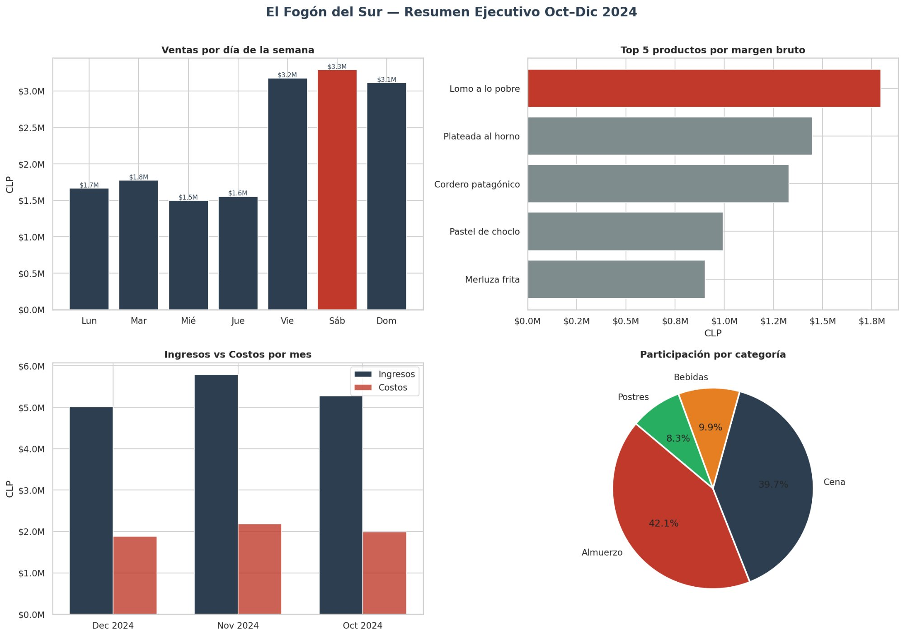

# 🍽️ Dashboard de Ventas — El Fogón del Sur

**Análisis de ventas y rentabilidad para restaurante chileno | Python + Looker Studio**

[](https://colab.research.google.com/github/paulinacarvacho/paulinacarvacho-dashboard-gastronomia-chile/blob/main/fogon_del_sur_analisis.ipynb)
[](https://lookerstudio.google.com/reporting/94181ae3-0e70-40d7-a17e-33261079766c)

---

## 📌 Contexto del proyecto

Este proyecto simula un caso real de análisis de datos para un restaurante de la Patagonia chilena. El objetivo es responder las preguntas de negocio más urgentes que tiene un dueño de restaurante que **no sabe exactamente si está ganando o perdiendo, ni en qué días, ni con qué productos.**

Fue desarrollado como parte de un portafolio de Data Analytics orientado a proyectos freelance para el sector gastronómico y PYME en Chile.

---

## ❓ Preguntas de negocio que responde

| # | Pregunta | Insight encontrado |
|---|---|---|
| 1 | ¿Cuáles son los días de mayor venta? | **Sábado lidera** con $3.3M en ventas del período |
| 2 | ¿Qué productos son más rentables? | **Lomo a lo pobre** genera el mayor margen bruto |
| 3 | ¿Cómo está el flujo de caja mensual? | Margen bruto promedio del **62%** en los 3 meses |
| 4 | ¿Hay tendencias preocupantes? | Noviembre fue el mes de mayor venta ($5.8M) |

---

## 🛠️ Herramientas utilizadas

| Herramienta | Uso |
|---|---|
| Python (Pandas, NumPy) | Generación y transformación de datos |
| Matplotlib + Seaborn | Visualizaciones estáticas |
| Google Sheets | Almacenamiento y conexión con dashboard |
| Looker Studio | Dashboard interactivo online |
| Google Colab | Entorno de desarrollo |

---

## 📊 Vista previa del análisis



🔗 **[Ver dashboard interactivo en Looker Studio →](https://lookerstudio.google.com/reporting/94181ae3-0e70-40d7-a17e-33261079766c)**

---

## 📁 Estructura del repositorio

```
dashboard-gastronomia-chile/
│
├── fogon_del_sur_analisis.ipynb   # Notebook completo con análisis
├── ventas_fogon_del_sur.csv       # Dataset generado (1.700+ registros)
├── dashboard_fogon_del_sur.png    # Visualización estática Python
└── README.md                      # Este archivo
```

---

## 🚀 Cómo reproducir el análisis

1. Abre el notebook en Google Colab con el badge de arriba
2. Ejecuta las celdas en orden (Shift + Enter)
3. El CSV se genera automáticamente
4. Sube el CSV a Google Sheets y conecta con Looker Studio

---

## 💡 Aplicabilidad real

Este análisis es directamente aplicable a cualquier restaurante, cafetería o negocio gastronómico que maneje sus ventas en Excel o en un sistema de punto de venta (POS). El dashboard en Looker Studio es **gratuito para el cliente y se actualiza automáticamente** al ingresar nuevos datos en el Sheet.

---

## 👩‍💻 Autora

**Paulina Carvacho Rubilar**
Analista de Datos | Administración de Empresas + Data Analytics

[](https://linkedin.com/in/paulina-carvacho)
[](https://github.com/paulinacarvacho)
